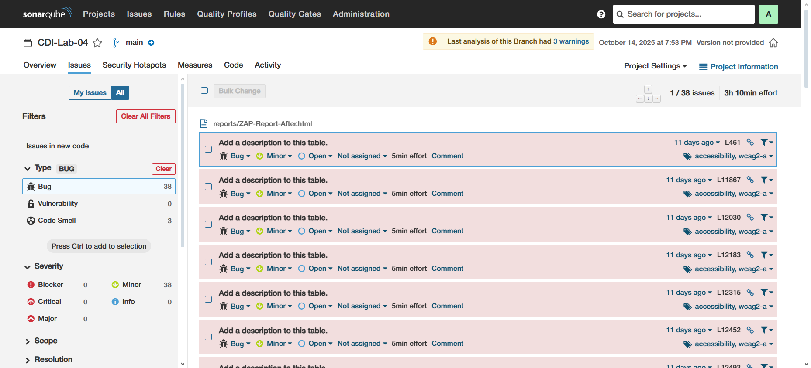
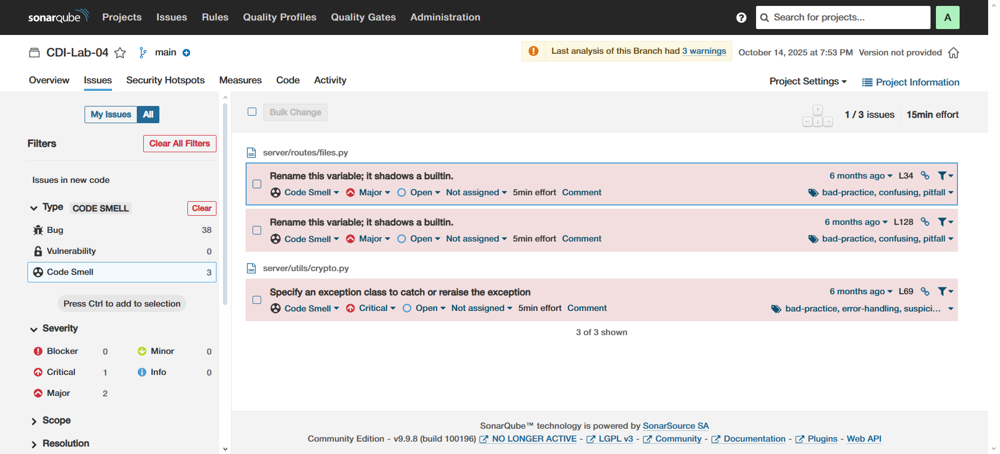

# DSS-Project-SAST
Repositorio para el proyecto de SAST del curso Desarrollo Seguro de Software.

# Pasos para levantar Sonarqube
**Disclaimer**: Funcionó para Windows, no sé si funcionará para Linux.

En la raiz del repositorio, ejecutar:
```bash
docker-compose up -d
```

Esperar 2-3 minutos a que el servicio se levante, luego ingresar a:
```bash
http://localhost:9001
```

Ingresar las credenciales:
* Usuario: `admin`
* Contraseña: `admin`

# Tokens
* **sast-analysis-01**: sqp_042d656a7730d33d7fee13822bf3d24e9dd0de4c

# Análisis SAST
**Disclaimer**: Para poder realizar el análisis, es necesario instalar [SonarScanner](https://docs.sonarsource.com/sonarqube-server/9.9/analyzing-source-code/scanners/sonarscanner).

En la raiz del proyecto a analizar, ejecutar:
```bash
sonar-scanner.bat -D"sonar.projectKey=MI_PROJECT_KEY" -D"sonar.sources=." -D"sonar.host.url=http://localhost:9001" -D"sonar.login=MI_TOKEN_GENERADO"
```
Reemplaza:
* `MI_PROJECT_KEY` con la key de tu proyecto
* `MI_TOKEN_GENERADO` con el token que generaste

En nuestro caso (para el proyecto que yo cree) sería:
```bash
sonar-scanner.bat -D"sonar.projectKey=CDI-Lab-04" -D"sonar.sources=." -D"sonar.host.url=http://localhost:9001" -D"sonar.login=sqp_042d656a7730d33d7fee13822bf3d24e9dd0de4c"
```

# Resultados de SonarScanner


